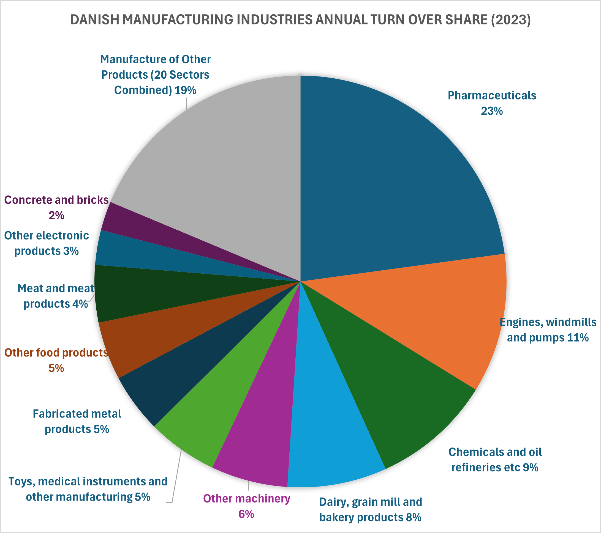
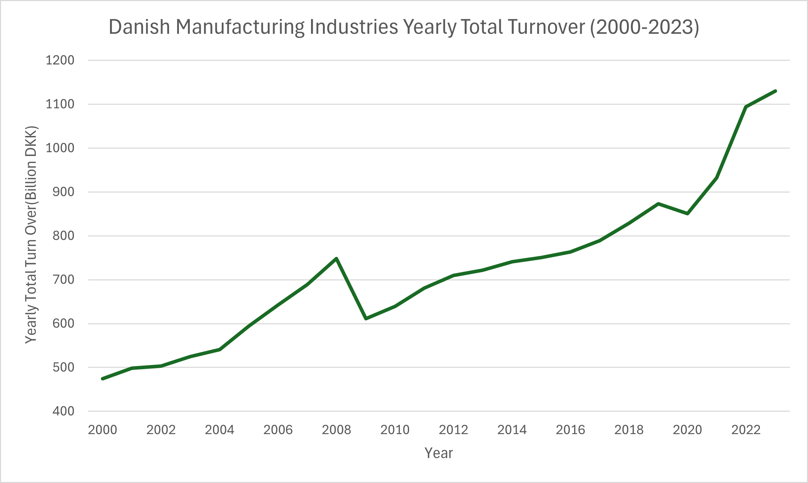
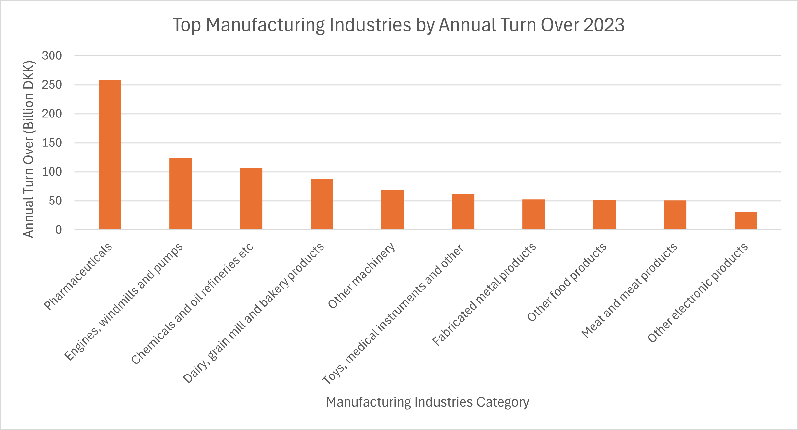

## 📊 Results

### 1. Annual Turnover Share by Industry (2023)

The pie chart reveals the relative contribution of each manufacturing sector to Denmark’s total manufacturing turnover in 2023:

- **Pharmaceuticals** dominate with **23%**, reflecting Denmark’s strong global position in medical production.
- **Engines, windmills and pumps** contribute **11%**, highlighting the importance of green tech and mechanical engineering.
- **Chemicals and oil refineries** follow with **9%**, showing continued relevance despite sustainability shifts.
- **Dairy, grain mill and bakery products** account for **8%**, underscoring Denmark’s agricultural-industrial link.
- The remaining sectors each contribute between **2% and 6%**, with **19%** combined under “Other Products,” indicating a diverse industrial base.

  

This distribution shows a high concentration in pharmaceuticals, likely driven by global exports and innovation. The presence of windmill-related industries reflects Denmark’s renewable energy leadership. The food sectors maintain a solid share, reinforcing their role in both domestic supply and export.

---

### 2. Yearly Total Turnover Trend (2000–2023)

The line graph shows a steady increase in total turnover from approximately **400 billion DKK in 2000** to **over 1100 billion DKK in 2023**:

- A dip around 2009 aligns with the global financial crisis.
- Post-2010, turnover rises steadily, with a sharp surge from 2021 to 2023.

  

  

The long-term growth reflects industrial resilience and innovation, especially in high-value sectors like pharmaceuticals and machinery. The 2021–2023 spike may be linked to post-pandemic recovery, increased exports, and green tech investments. This trend suggests Denmark’s manufacturing sector is not only stable but expanding in global relevance.

---

### 3. Top Industries by Turnover (2023)

The bar chart ranks industries by absolute turnover:

- **Pharmaceuticals** lead by a wide margin.
- **Engines, windmills and pumps**, **chemicals**, and **food processing** follow.
- Lower turnover is seen in **electronics**, **meat**, and **miscellaneous manufacturing**.

   

   
   

The dominance of pharmaceuticals in both share and absolute turnover confirms its strategic importance. The strong performance of mechanical and chemical sectors supports Denmark’s export-driven economy. Lower turnover in electronics may reflect outsourcing or niche specialization rather than volume.

